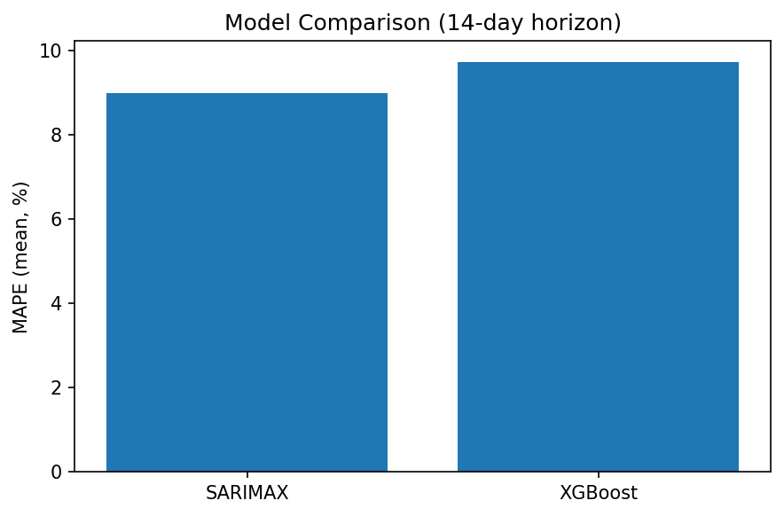

# 📊 Revenue Forecasting & Demand Optimization

This project demonstrates an **end-to-end forecasting workflow** using both **statistical methods (SARIMAX)** and **machine learning (XGBoost)**.

It highlights skills in **business intelligence, forecasting, and applied analytics** that translate across industries such as **gaming, retail, finance, and hospitality**.

---

## 🚀 Project Overview
- Generate **synthetic revenue data** with realistic seasonality, trends, and promotional effects.  
- Explore data through **EDA & feature engineering**.  
- Build a **statistical baseline** with SARIMAX (classical time series).  
- Train **machine learning models** with XGBoost for tabular forecasting.  
- Perform **rolling backtests** for robust evaluation.  
- Save and compare results in reproducible **artifacts (CSV, PNG)**.  

---

## 📂 Repository Structure
├── app/ # Future Streamlit dashboard
├── configs/ # Config files (holidays, params)
├── data/ # Raw, interim, processed (ignored in Git)
├── notebooks/ # Jupyter notebooks for exploration
│ ├── 00_data_audit.ipynb
│ ├── 10_feature_eng_and_eda.ipynb
│ ├── 20_baselines_sarima.ipynb
│ ├── 30_ml_forecasting_xgboost.ipynb
│ ├── 40_backtesting_and_model_selection.ipynb
│ └── 60_report_figures.ipynb
├── reports/ # Generated results
│ ├── figures/ # PNG plots
│ └── tables/ # CSV outputs
├── scripts/ # Automation scripts
│ ├── make_sarimax_artifacts.py
│ ├── make_model_comparison.py
├── src/ # Modular Python code (ETL, features, modeling, utils)
├── tests/ # Unit tests
└── requirements.txt # Reproducible environment

yaml
Copy code

---

## 📊 Forecasting Results

### 🔹 Baseline: SARIMAX 14-Day Forecast
SARIMAX serves as the **classical time series baseline**, capturing weekly seasonality and promotional effects.  


---

### 🔹 Model Comparison (SARIMAX vs XGBoost)
To evaluate whether ML provides additional value, we compared **rolling backtest errors** (14-day horizon).  

| Model   | Mean MAE | Mean MAPE |
|---------|----------|-----------|
| SARIMAX | 103.687  | 8.991     |
| XGBoost | 118.315  | 9.734     |



**Key Insight:**  
- SARIMAX performs slightly better on synthetic data (lower MAE/MAPE).  
- XGBoost remains competitive, offering flexibility for future feature-rich datasets.  
- This demonstrates how baselines and ML can complement each other in real-world business intelligence workflows.  

---

## ⚙️ Setup & Reproducibility

1. **Clone repo**
   ```bash
   git clone https://github.com/dyepezds/revenue-forecasting-optimization.git
   cd revenue-forecasting-optimization
   
2. **Create environment**
    ```python -m venv .venv
    source .venv/bin/activate  # or .venv\Scripts\activate on Windows
    pip install -r requirements.txt```
   
3. **Run notebooks**
    
    ```jupyter lab```


4. **Re-generate artifacts**
   ```
    python -m scripts.make_sarimax_artifacts
    python -m scripts.make_model_comparison```

---

## 🔮 Next Steps

- Add Prophet and LSTM/DeepAR for deeper comparisons.
- Deploy interactive Streamlit app for decision-makers.
- Test with real-world datasets (business, retail, finance).
- Extend into demand optimization for operations planning.

---

## 🧑‍💻 Author

Daniel Yepez 

Data Science | Business Intelligence | Forecasting 🔗 LinkedIn | GitHub