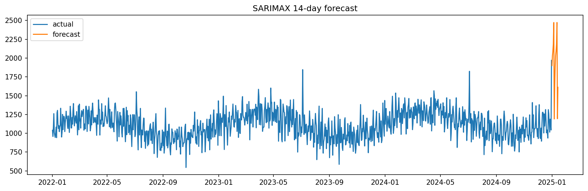

# Revenue Forecasting & Demand Optimization

## Overview
This project demonstrates how to build and compare forecasting models for business intelligence use cases (e.g., revenue, demand planning, staffing).  
We implement both **classical time-series models (SARIMAX)** and **machine learning models (XGBoost)** to forecast daily revenue with exogenous features such as promotions and calendar effects.

## Project Structure
├── app/ # Streamlit app (UI)
├── configs/ # Configuration files
├── data/ # Raw, interim, processed datasets
├── notebooks/ # Jupyter notebooks (EDA, models, evaluation)
├── reports/ # Generated figures & tables
├── scripts/ # Utility scripts for reproducibility
└── src/ # Core Python modules (ETL, features, modeling, etc.)

markdown
Copy code

## Baseline Results (SARIMAX)
- **Setup**: Seasonal weekly structure, exogenous features: `promo`, `is_weekend`, `dayofweek`, `month`
- **Backtest**: Expanding window, 14-day horizon, 6 folds
- **Metrics**:
  - Mean MAPE (14-day): **X%**
  - Mean MAE: **Y**

**Forecast (next 14 days):**  

---

## Next Steps
- Add **XGBoost** forecasting and benchmark against SARIMAX  
- Implement **demand optimization** (linear programming)  
- Wrap results into a Streamlit app for interactive exploration